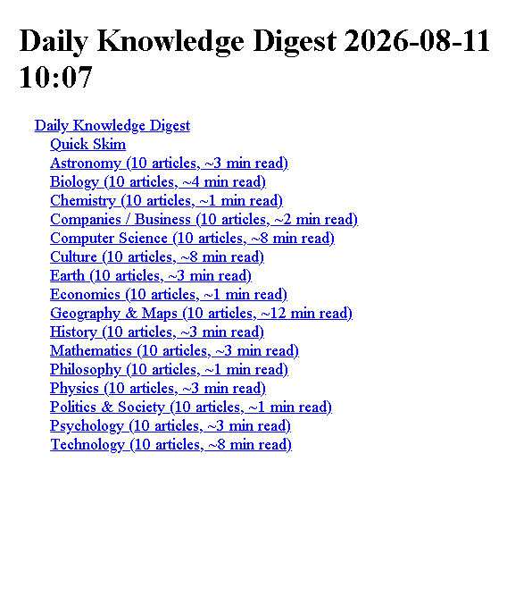
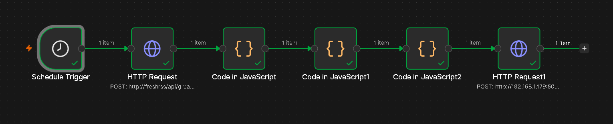
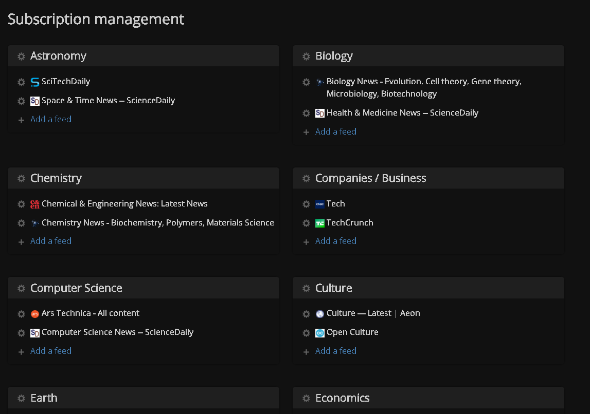
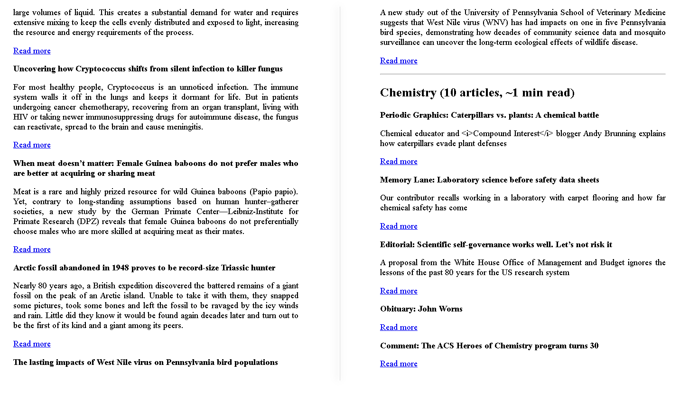

<div align="center">

# Kindle Daily Digest Pipeline

**A self-hosted content pipeline that curates knowledge from RSS sources, renders it as an EPUB and delivers it to a Kindle. Twice a day, at zero monthly cost, with zero dependency on AI usage limits.**


</div>

---

## Overview

Every morning and evening this pipeline logs into a self-hosted RSS reader, pulls fresh articles across 18 curated categories, ranks and deduplicates them with fixed rules, extracts full article text, renders everything into a single EPUB with an in-document index, and emails it to a Kindle Paperwhite. No manual step anywhere in the loop.

It runs across two LXC containers on a home Proxmox VE server, orchestrated by n8n and a lightweight Flask receiver. It costs nothing to operate on an ongoing basis.

<p align="center">
  
  <br>
  <sub>The Quick Skim index at the top of every digest. Every headline, every category, one screen.</sub>
</p>

## Table of contents

- [Why this exists](#why-this-exists)
- [Architecture](#architecture)
- [How it works](#how-it-works)
- [Design decisions](#design-decisions)
- [Reliability](#reliability)
- [What this deliberately doesn't do](#what-this-deliberately-doesnt-do)
- [Stack](#stack)
- [Setup](#setup)

## Why this exists

An earlier version of this pipeline used Claude Code, running against an existing Pro subscription, to search the web, summarize articles and write curated recommendations. It worked. It also had a real reliability problem. A single run could exhaust the subscription's usage window, especially with live web search layered on top of RSS fetching and synthesis. When that happened the digest simply didn't arrive. Silently.

This version replaces AI synthesis with deterministic, rule-based curation: source-authority weighting, per-feed volume caps, cross-category deduplication, and freshness sorting. The tradeoff is explicit. Less editorial judgment, in exchange for a system that cannot break from a usage cap, because it makes zero calls to any LLM. The full reasoning is in [`docs/tradeoffs.md`](docs/tradeoffs.md).

## Architecture

Two containers, talking over the local network.

```
+------------------------------+              +-------------------------------+
|   knowledge-feed (LXC)        |              |   kindle-digest (LXC)          |
|                                |              |                                 |
|   FreshRSS                    |              |   Flask receiver                |
|   18 curated categories       |              |                                 |
|        |                      |              |   POST /receive-digest          |
|        v                      |   POST       |     -> pandoc -> EPUB           |
|   n8n workflow                |------------->|     -> archive dated copy       |
|   - Schedule: 6am / 6pm       |  digest.md   |     -> email to Kindle          |
|   - Fetch, rank, dedupe       |              |                                 |
|   - Assemble digest.md        |<-------------|   POST /extract                 |
|                                |   full text  |     -> trafilatura              |
+------------------------------+              |                                 |
                                                |   GET /weekly-archive           |
                                                |     -> 7 day rollup source      |
                                                +-------------------------------+
```

## How it works

| Step | Component | What happens |
|---|---|---|
| 1 | **FreshRSS** | 18 categories (Physics, Biology, Chemistry, Earth, Astronomy, Mathematics, Computer Science, Economics, History, Psychology, Philosophy, Politics and Society, Culture, Technology, Companies and Business, Geography and Maps, Entertainment, Facts and Things to Know). 2 to 3 readable, authoritative sources each. |
| 2 | **n8n, Schedule Trigger** | Fires twice daily, 6:00 AM and 6:00 PM. |
| 3 | **n8n, Fetch node** | Authenticates against FreshRSS's Google Reader compatible API, pulls unread articles per category, applies a per-feed volume cap, sorts by source authority then freshness, marks fetched items as read. |
| 4 | **n8n, Assembly node** | Deduplicates near-identical titles across categories, calls the receiver's `/extract` endpoint for full article text, applies per-category article limits, estimates reading time, builds a Quick Skim index that jumps to each article's in-document anchor plus a link to the original source, timestamps everything in EST. |
| 5 | **Flask receiver** | Renders the finished markdown to EPUB with pandoc, archives a dated copy, emails it to the Kindle's Send-to-Kindle address. |

<p align="center">
  
  <br>
  <sub>The full n8n workflow: schedule, FreshRSS login, fetch and rank and dedupe, assemble, send to receiver.</sub>
</p>

<p align="center">
  
  <br>
  <sub>FreshRSS subscription management. 18 categories, 2 to 3 readable, authoritative sources each.</sub>
</p>

*Note: the screenshot above may show an earlier category count. The current list is documented in `docs/setup.md`.*

## Design decisions

**Why n8n calls out to a Flask receiver instead of doing everything itself**
Pandoc and the email-sending logic already existed and worked on the `kindle-digest` container from an earlier iteration. This n8n instance also doesn't expose an Execute Command node, so a small internal HTTP endpoint was the simplest reliable bridge between the two.

**Why source weighting instead of AI ranking**
A short list of institutional and primary source names (NASA, Nature, BBC, Federal Reserve and similar) is checked against each article's origin feed. Those sort ahead of secondary sources before a freshness sort. Deterministic, free and fully auditable. Every inclusion traces back to a specific rule, not a model decision.

**Why a per-feed cap instead of a per-category cap**
Early testing turned up a real failure mode. One high-volume source (a chemistry news aggregator with 400 plus unread items) dominated its entire category's fetch budget on its own. Capping each individual feed, rather than the category as a whole, stops any single source from crowding out the others.

**Why full-text extraction has a timeout**
The `/extract` endpoint makes a live HTTP request per article. Without a timeout, one slow or unreachable source could stall an entire run. An 8 second timeout with a silent fallback to the RSS summary keeps the pipeline resilient to any single bad source.

**Why Quick Skim links jump inside the epub instead of out to the web**
Each article is rendered as a heading with its own anchor id, so the Quick Skim index at the top links straight to the full article already sitting in the same file. No network dependency, works the same on an e-ink Kindle as in an app. A small second link next to each entry still points to the original source online. Full reasoning in [`docs/tradeoffs.md`](docs/tradeoffs.md).

**Why images aren't embedded**
Coverage from RSS enclosure tags was inconsistent across feeds, and the receiver's text-extraction endpoint never returns images at all. Rather than leave image support half-working, it was removed. Full reasoning in [`docs/tradeoffs.md`](docs/tradeoffs.md).

<p align="center">
  
  <br>
  <sub>Full article text via trafilatura, not just RSS teasers. Each entry links back to the original source.</sub>
</p>

## Reliability

- Both containers are set to `onboot=1` in Proxmox, so they survive a host reboot.
- The Flask receiver runs as a systemd service (`Restart=always`), not a bare background process, so it survives crashes and restarts.
- Every digest is archived with a timestamp before it's sent, so nothing is lost even if the email step fails.
- Success and failure both push a notification through ntfy, so nothing fails silently.
- All timestamps are computed in `America/New_York` directly, independent of container system timezone.

## What this deliberately doesn't do

No AI synthesis. No live web search beyond the configured RSS feeds. No editorial judgment on story importance beyond source-authority weighting. Content quality is bounded by the curated feed list, not by an intelligence layer. That's a conscious tradeoff made after the earlier AI-driven version proved unreliable in production. Full reasoning in [`docs/tradeoffs.md`](docs/tradeoffs.md).

## Stack

`FreshRSS` · `n8n` · `Python` (`Flask`, `trafilatura`) · `pandoc` · `Proxmox VE` (LXC) · `Gmail SMTP` (Send-to-Kindle) · `ntfy` · `systemd`

## Setup

Full installation walkthrough in [`docs/setup.md`](docs/setup.md).

---

<div align="center">

Built and maintained as a homelab project on a Proxmox VE server running on a ThinkPad T14.

</div>
